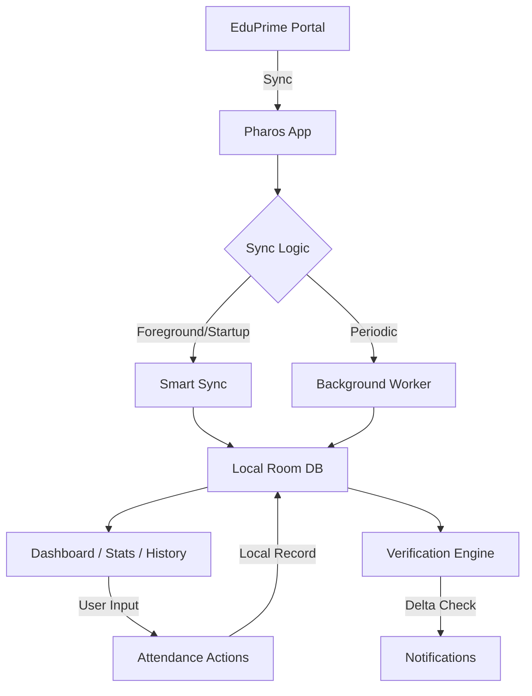

# PHAROS

Pharos is a smart academic companion designed for students to monitor, analyze, and forecast their attendance with precision. It integrates seamlessly with the EduPrime portal, providing an offline-first experience with robust synchronization and goal-based analysis.

## Overview

Pharos solves the problem of unreliable attendance tracking by bridging the gap between manual student logs and official portal records. It allows students to plan their absences, verify their records against official data, and stay on track with their academic goals.

## Features

### Attendance Management
*   **Class-Level Tracking**: Mark attendance for individual periods as **Present**, **Absent**, or **Bunk**.
*   **Special Situations**: Dedicated states for **Sports Event**, **College Event**, **Hackathon**, and **Volunteer** activities.
*   **Whole-Day Actions**: Quickly mark an entire day as a **Holiday** or **Absent** without affecting class-level flexibility.
*   **Preview Mode**: View and edit attendance for any day of the week via the dashboard's weekday selector.

### Leave Forecast V2
*   **Multi-Date Absence Planner**: Select multiple individual or consecutive future dates on a Sunday-first calendar.
*   **Predictive Analysis**: Forecasts your future attendance percentage based on your actual timetable.
*   **Assumed Attendance**: Intelligently assumes you will attend every unselected future class before and around your planned leave.
*   **Non-Destructive**: Purely hypothetical calculations that never modify your actual database records.

### Intelligent Synchronization
*   **Smart Sync**: Automatically refreshes data when the app moves to the foreground or on startup (15-minute throttled cooldown).
*   **Background Sync**: Periodic background updates using Android WorkManager.
*   **Connectivity Recovery**: Detects when internet is restored and triggers a sync check to ensure data freshness.
*   **Long-Gap Recovery**: Reliable catch-up logic even if the app hasn't been opened for weeks.

### Statistics & Analysis
*   **Overall Summary**: Real-time percentage tracking with "Safe Leave" and "Classes Needed" calculations.
*   **Threshold Awareness**: Clear visual indicators for the 75% danger threshold and 80% safety target.
*   **Subject Breakdown**: Detailed per-subject statistics including raw counts and risk levels.

### Data & Security
*   **Offline-First**: All data is stored locally in a Room database and is fully accessible without an internet connection.
*   **Data Preservation**: Explicit database migration strategy ensures that app updates never result in data loss.
*   **Credential Protection**: Login credentials are encrypted using the Android Keystore and protected by biometric authentication.
*   **Backup & Restore**: Export and import your entire attendance state as a secure JSON file.

### Update System
*   **GitHub Releases**: Uses official GitHub repository (Charan-Guduru/Pharos) as the authoritative update source.
*   **In-Place Updates**: Downloads and installs new versions directly over the existing app, preserving all user data.
*   **User-Friendly Prompts**: Automatic update notifications are limited to once per month to avoid intrusion.

## How Pharos Works



## Technical Architecture

*   **UI Layer**: Jetpack Compose for a modern, reactive Material 3 interface.
*   **ViewModel Layer**: State-driven architecture using Kotlin Coroutines and Flow.
*   **Repository Layer**: Decoupled data handling for network (Retrofit/Jsoup) and local storage (Room).
*   **Verification Engine**: A delta-based comparison system that anchors local claims against portal snapshots to detect mismatches accurately.
*   **Security**: `EncryptedSharedPreferences` and Android Keystore for sensitive metadata.

## Attendance Model

| Status | Meaning | Verification Rule |
| :--- | :--- | :--- |
| **PRESENT** | Attended the class. | Verified if portal count increases. |
| **ABSENT** | Missed the class. | Results in Mismatch if portal count increases. |
| **BUNK** | Deliberately skipped. | Verified if portal count does not increase. |
| **HOLIDAY** | College was closed. | Does not affect attendance counts. |
| **SPECIAL** | Sports, Event, etc. | Verified only if portal grants attendance. |

### Attendance Units
Pharos calculates "Attendance Units" based on timetable duration:
*   **1 Unit** = 1 hour (approx. 60 mins).
*   **Rounding**: Uses `(durationMinutes + 30) / 60` to determine the integer unit count.
*   **Example**: A 3-hour Laboratory entry (10:00 - 13:00) counts as **3 classes**.

## Project Structure

```
app/
├── src/
│   └── main/
│       ├── java/com/vnrvjiet/attendancemonitor/
│       │   ├── data/            # Entities, DAOs, Repositories, API
│       │   ├── ui/              # Screens, Components, Theme, Navigation
│       │   ├── worker/          # WorkManager Sync Workers
│       │   └── util/            # Security, Time, and Navigation Utils
│       ├── res/                 # Layouts, XML Rules, Drawables
│       └── AndroidManifest.xml
├── build.gradle.kts             # Build config and versioning
└── ...
```

## Build & Development

To build a debug APK:
```powershell
./gradlew assembleDebug
```
The APK will be generated at: `app/build/outputs/apk/debug/app-debug.apk`

*   **Application ID**: `com.vnrvjiet.attendancemonitor`
*   **Min SDK**: 26 (Android 8.0)
*   **Target SDK**: 35 (Android 15)

## Version History

*   **v1.0.7**: Calendar UI polish, Sunday-first ordering, and refined multi-date UX.
*   **v1.0.6**: Flexible multi-date selection for Leave Forecast.
*   **v1.0.5**: Initial Multi-Day date-range forecast implementation.
*   **v1.0.4**: Overhauled update detection with semantic versioning.
*   **v1.0.3**: Special situation verification (Sports, Events, etc.).
*   **v1.0.2**: Bunk notification fix and whole-day action refinements.
*   **v1.0.1**: Critical verification correctness fix (Snapshot-Anchored Delta).

## Current Status
*   **Current Version**: 1.0.7
*   **Version Code**: 7
*   **Major Capabilities**: Full sync, Leave Forecast V2, In-place Updates, Verification Engine.

## Known Limitations
*   Non-attendance subjects without codes currently cannot be added to the timetable.

---
*Pharos is maintained as a living project. Documentation is updated with every implementation task.*
